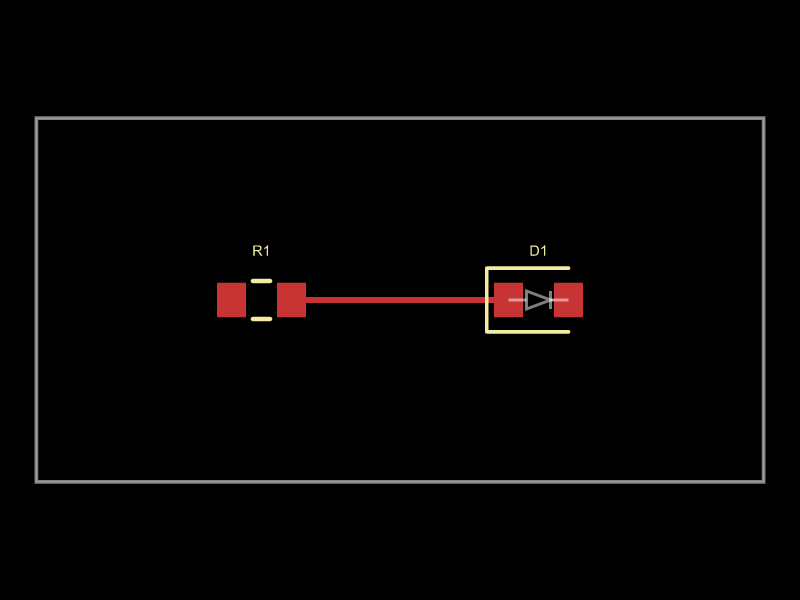
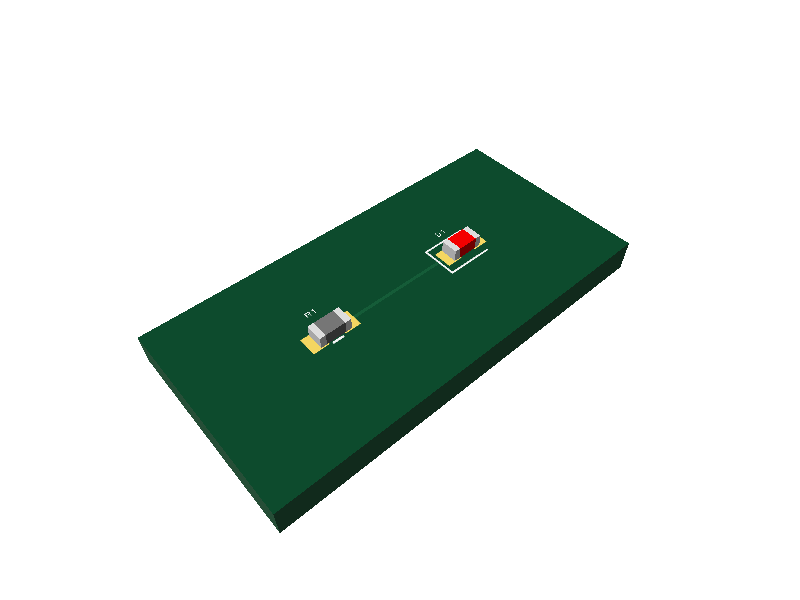

# <project name>






PCB design written in [tscircuit](https://tscircuit.com) (React/TSX, compiled by the `tsci` CLI). This file is the project doc: the brief (requirements) the design is built from, then design decisions and status, kept current as the design evolves.

> Template note: the circuit and images above are a placeholder (one resistor, one LED, one connection). Fill in **Requirements** below, then ask Claude to build the design from this README; see `CLAUDE.md`.

## Status

Template: placeholder example only, no real design yet.

## Requirements

Fill in everything marked `TODO` before designing. Delete a bullet only if it clearly does not apply.

- **Purpose:** TODO (what the board does, in one or two sentences, with the key numbers: timing, current, frequency, ...)
- **Board size / form factor:** TODO (outline in mm, single/double sided, which side parts go on)
- **Power sources and rails:** TODO (input voltage and connector, rails the design needs, current budget)
- **I/O (connectors, headers, mounting holes):** TODO (connector type/pitch/pin labels, mounting hole count/size/position, buttons, LEDs, test points)
- **Mechanical constraints:** TODO (enclosure, keep-outs, height limits, or "none")
- **Manufacturer and constraints:** JLCPCB; all resistors/capacitors 0603; basic parts where one exists; Economic assembly (only parts marked "PCBA Type: Economic and Standard", never "Standard Only"). Change if this project differs.

## Design notes

Calculations and the reasoning behind part values, footprints, grounding, trace widths, routing. Record why, not only what.

Layout rules: see [DESIGN.md](DESIGN.md).

## Finding JLCPCB parts

Query the [jlcsearch](https://jlcsearch.tscircuit.com/) JSON API. Prefer basic parts (`is_basic=true`) and pick the highest stock. Example for 22k 0603 resistors:

`https://jlcsearch.tscircuit.com/resistors/list.json?package=0603&is_basic=true&is_preferred=&resistance=22000`

Then open the part page (`https://jlcpcb.com/partdetail/C<number>`) and confirm it says `PCBA Type: Economic and Standard`; jlcsearch does not expose this flag. Record the chosen part as `supplierPartNumbers={{ jlcpcb: ["C..."] }}` in `index.circuit.tsx`. Only fall back to non-basic (extended) parts if no basic one fits.

Also browse [tscircuit datasheets](https://tscircuit.com/datasheets) to discover elements.

## Setup

Requires Node and [Bun](https://bun.sh) (`tsci` runs under Bun; make sure `~/.bun/bin` is on PATH).

```bash
npm install
npm start           # tsci dev: interactive preview
npx tsci build      # compile and validate, output in dist/
npx tsci snapshot -u   # regenerate the schematic SVG snapshot (__snapshots__/index.circuit-schematic.snap.svg, embedded at the top of this README)
npm run export:images    # rebuild and refresh docs/images/{pcb,3d}.png (embedded at the top of this README)
npm run update:skill   # re-install the latest tscircuit AI skill into .claude/skills/tscircuit/ (review with git diff, commit with skills-lock.json)
```

Before sharing or fabricating, work through the checks in order: `tsci check netlist`, `schematic-placement`, `placement`, `routing-difficulty`, then `tsci build`, then `tsci check shorts`. See `.claude/skills/tscircuit/CHECKLIST.md` for the pre-fab checklist.

## References

- [tscircuit docs](https://docs.tscircuit.com/); the full docs are also available as one text file at https://docs.tscircuit.com/llms.txt
- [DESIGN.md](DESIGN.md): PCB alignment, routing, mounting, schematic and placement rules
- [tscircuit datasheets](https://tscircuit.com/datasheets)
- [jlcsearch](https://jlcsearch.tscircuit.com/)
- AI skill: [tscircuit/skill](https://github.com/tscircuit/skill), installed in `.claude/skills/tscircuit/`

## Open questions / TODO

Things still to verify or decide (e.g. human review of routing/silkscreen in `tsci dev`, component rotations in JLCPCB's assembly preview before ordering).

## Decisions

Choices made and the alternatives rejected, so they are not re-litigated.
